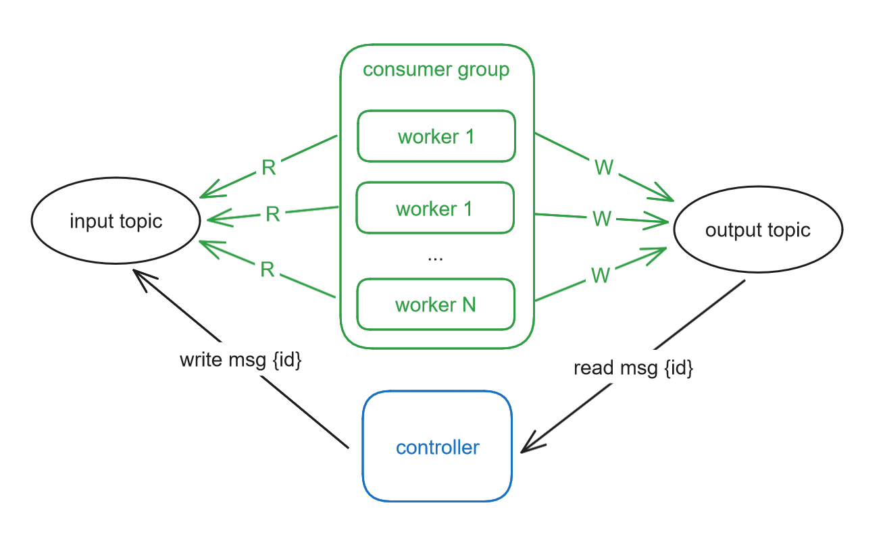

# Kubernetes and Kafka Consistency Checks

## Motivation

Wanted to try out to build an [EOS Kafka](https://www.confluent.io/en-gb/blog/simplified-robust-exactly-one-semantics-in-kafka-2-5/) application that's resilient to random failures. There's a very common pattern in Kafka where you read from an input topic, make some transformations (new message), and write the result in a different topic. This seems trivial at first glance, but since the app needs to both: 1) write to the output topic, 2) commit the offsets to the input topic, a whole range of failure scenarios open up.

To achieve this in a simple way, the idea was to have one app (_controller_) that writes to an input topic and expects to find the same messages on an output topic (order not important). There would be _N worker_ apps that consume from the input topic and write to the output one. Both topics have a fixed amount of partitions, so consumers can share them (via Kafka consumer groups).

The high-level diagram looks like:



Further, I wanted these apps to be written in Python, and running totally in Kubernetes (in a toy cluster I have running locally).

### Worker

The _workers_ use transactions to ensure that consuming from the input topic (commiting offsets) and writing to the output topic is done in an atomic fashion. Since the _workers_ are all part of the same consumer group, Kafka manages which input topic partitions are assigned to each consumer.

To add some chaos in the mix, the _workers_ have a small chance of ungracefully terminating (`sys.exit()`) whenever they read a message from the input topic. When this happens, the transaction is not rolled back and instead we let Kafka time it out. As the partitions of the terminated _worker_ get assigned to other _workers_, the latter start off at the last committed offsets for those partitions.

Crucially, as new _workers_ join/leave the group. The _worker_ relies on the `on_revoke` callback to commit the current open transaction. If committing fails, the _worker_ attempts to rollback the transaction and start a new one. Therefore, when rebalancing finishes, all _workers_ are able to then consume from offsets that have not be committed yet, regardless of if they were previously read by other nodes (that didn't manage to commit their transaction).

All of this naturally means a bit of duplicated work where N _workers_ could read the same message, albeit not at the same time! However, what's important is that only one of them will be able to commit the messages (and offsets). Thus, ensuring EOS.

Terminated _workers_ get restarted by the underlying execution platform, automatically (Docker for Compose, or Kubernetes).

### Controller

The _controller_ keeps track of which message (`ids`) it produced and so it will log whenever it detects an issue. For example, the _controller_ logs whenever:

* it receives a message with an `id` is does not recognise (or is a duplicate)
* it has not found the `id` in the output topic after a certain amount of time

A very important detail is that the _controller_ only reads committed messages from the output topic. Which is a requirement when consuming from topics written to via Kafka transactions. Note the following configuration option when creating the consumer instance:

```python
{
    ...
    'isolation.level': 'read_committed'
}
```

The _controller_ does not use transactions when producing since the main point of interest was applying EOS to the _workers_.

## Python

To enable local development, you can run:

```bash
# create the venv
python -m venv kube-kafka
# and active it
source kube-kafka/Scripts/activate

# install the needed dependencies
pip install -r requirements.txt
```

## Kubernetes

I won't go into details of how to run a Kubernetes cluster. Assuming you have one, you can run this via:

```bash
# apply all kube config, instantiating the application
kubectl apply -f kubernetes/namespace.yml
kubectl apply -f kubernetes --recursive
```

Note: This pulls the _worker_ and _controller_ Docker images from GitHub packages.

## Docker and GH packages

To build and push the Docker images to GitHub packages, you can use:

**Just remember to change the username!**

```bash
# docker login
echo $GITHUB_TOKEN | docker login ghcr.io -u rjmarques --password-stdin

# build local docker image (for each app)
docker build -f src/Dockerfile -t ghcr.io/rjmarques/controller:latest --build-arg 'TARGET=controller' .
docker build -f src/Dockerfile -t ghcr.io/rjmarques/worker:latest --build-arg 'TARGET=worker' .

# push to GH registry
docker push ghcr.io/rjmarques/controller:latest
docker push ghcr.io/rjmarques/worker:latest
```

## Running locally

All you need to run locally is Docker. There's a `docker-compose.yml` that instantiates the whole system (including Kafka). Simply run:

```bash
docker-compose up
```

This spins up:

* kafka and zookeper
* kafka registry (needed for transactions)
* controller
* 3 workers

## Kafka (inspecting)

```bash
# use kcat via docker
# in this example kubernetes is available at 'kube.local:30092'
docker run -it --network=host --rm edenhill/kcat:1.7.1 -b kube.local:30092 -L

# use kcat directly
kcat -L -b mybroker
```
